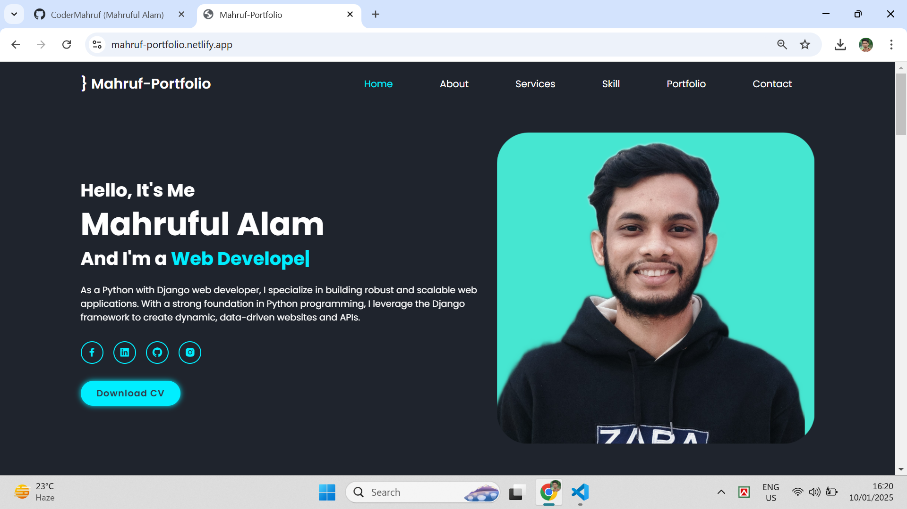

# Mahruful Alam's Portfolio Website

This repository contains the source code for **Mahruful Alam's Personal Portfolio Website**, showcasing skills, projects, and services as a web developer specializing in Python and Django.

## Project Overview
The portfolio is a responsive, modern website designed to highlight Mahruful's expertise in web development, along with skills in graphic design and digital marketing. It also includes professional information, coding and technical skills, and a call-to-action for downloading the CV.


---

## Features

- **Home Section:**
  - Introduction with a professional photograph.
  - Brief description highlighting expertise in Python and Django.
  - Quick access to social media profiles and a downloadable CV button.

- **Services Section:**
  - **Web Development:** Detailed information on creating scalable and robust web applications.
  - **Graphic Design:** Experience in tools like Adobe Photoshop and Canva.
  - **Digital Marketing:** Expertise in SEO, social media marketing, and content creation.

- **Skills Section:**
  - Coding skills include HTML5, CSS3, JavaScript, Python, Django, and modern frameworks like Tailwind CSS and React.js.
  - Professional skills in web design, APIs integration, and machine learning basics.

---

## Tech Stack

- **Frontend:** HTML5, CSS3, Bootstrap, Tailwind CSS, JavaScript, React.js
- **Backend:** Node js
- **Hosting:** Netlify

---

## How to Run Locally

1. Clone the repository:
   ```bash
   git clone <https://github.com/CoderMahruf/portfolio_project.git>
   ```

2. Open your browser and visit `https://mahruf-portfolio.netlify.app/#` to view the site.

---

## Screenshots

### Home Page


### Services Page


### Skills Page


---

## Contact

For any queries or collaboration, you can reach out:

- Email: [mahruf9060@gmail.com](mahruf9060gmail.com)
- LinkedIn: [Your LinkedIn Profile](https://www.linkedin.com/in/codermahruf/)
- GitHub: [Your GitHub](https://github.com/CoderMahruf)

---

## License
This project is licensed under the MIT License. 

